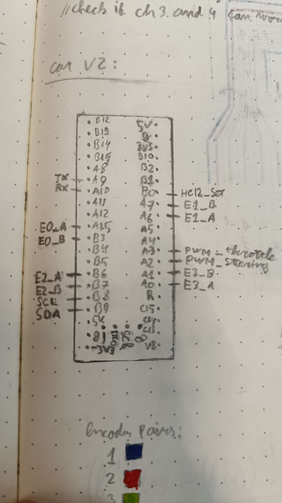
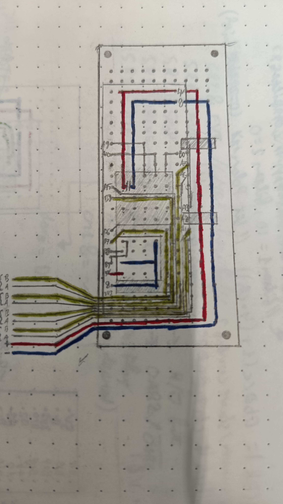
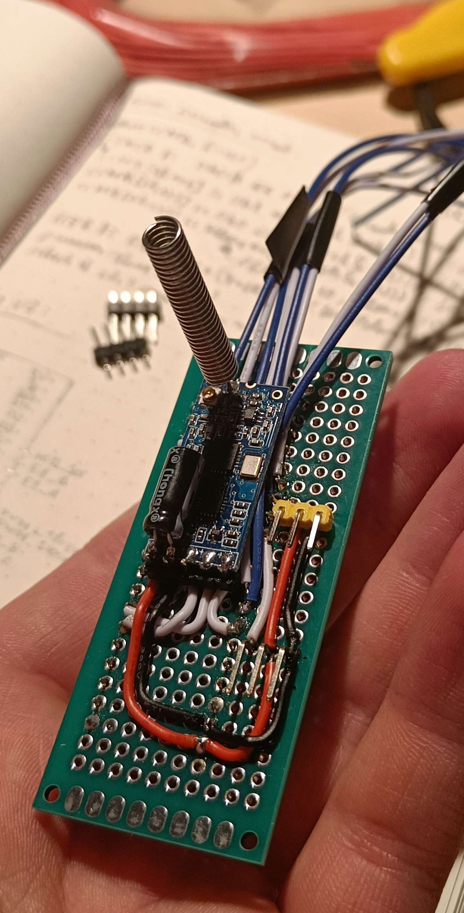

# CAR
car project based on the STM32F411CEU6

# Design




# Components
* STM32F411CEU6     (Microcontroller)
* HC-12             (Radio module)
* 24LC512           (EEPROM)
* 4 * Optical rotary encoders

# Software
* sys_clock
* GPIO
* TIM
  * PWM
  * Encoder (mode)
* USART
* I2C
* CRC
* Watchdog

## sys_clock
> ### Config
> | Clock     | Speed   |
> |-----------|---------|
> | sys (PLL) | 100 MHz |
> | AHB1      | 100 MHz |
> | APB1      | 50 MHz  |
> | APB2      | 100 MHz |
> * Systick on
> * Systick IRQ on
> * Flash prefetch on
> * Flash instruction cache on
> * Flash data cache on
> ##
> ### Code
> ```C
> int main(void) {
>   // sys_clock: 25Mhz / 15 * 120 / 2 = 100Mhz
>   SYS_CLK_Config_t* sys_config = new_SYS_CLK_config();
>   set_SYS_PLL_config(sys_config, 15, 120, PLL_P_DIV2, 0, PLL_SRC_HSE);
>   set_SYS_CLOCK_config(sys_config, SYS_CLK_SRC_PLL, AHB_CLK_NO_DIV, APBx_CLK_DIV2, APBx_CLK_NO_DIV, 0);
>   set_SYS_FLASH_config(sys_config, FLASH_LATENCY4, 1, 1, 1);  // latency is set automatically (when need be)
>   set_SYS_tick_config(sys_config, 1, 1);
>   sys_clock_init(sys_config); free(sys_config);
> }
> ```

## GPIO
> ### Config
> | pin | mode               | pull | output_type | speed     | af | function description                |
> |-----|--------------------|------|-------------|-----------|----|-------------------------------------|
> | B0  | output             | none | open drain  | low       | -  | enable settings mode on the HC-12   |
> | A9  | alternate function | none | push pull   | very high | 7  | TX pin for USART1                   |
> | A10 | alternate function | none | push pull   | very high | 7  | RX pin for USART1                   |
> | B8  | alternate function | none | open drain  | very high | 4  | SCL pin for I2C1                    |
> | B9  | alternate function | none | open drain  | very high | 4  | SDA pin for I2C1                    |
> | A15 | alternate function | none | push pull   | very high | 1  | signal A for Encoder1 (TIM2)        |
> | B3  | alternate function | none | push pull   | very high | 1  | signal B for Encoder1 (TIM2)        |
> | A6  | alternate function | none | push pull   | very high | 2  | signal A for Encoder2 (TIM3)        |
> | A7  | alternate function | none | push pull   | very high | 2  | signal B for Encoder2 (TIM3)        |
> | B6  | alternate function | none | push pull   | very high | 2  | signal A for Encoder3 (TIM4)        |
> | B7  | alternate function | none | push pull   | very high | 2  | signal B for Encoder3 (TIM4)        |
> | A0  | alternate function | none | push pull   | very high | 2  | signal A for Encoder4 (TIM5)        |
> | A1  | alternate function | none | push pull   | very high | 2  | signal B for Encoder4 (TIM5)        |
> | A2  | alternate function | none | push pull   | very high | 3  | PWM output pin for channel1 of TIM9 |
> | A3  | alternate function | none | push pull   | very high | 3  | PWM output pin for channel2 of TIM9 |
> ##
> ### Code
> Code for the alternate function pins is displayed under the section for said peripheral
> ```C
> int main(void) {
>   config_GPIO(HC12_SET_PORT, HC12_SET_PIN, GPIO_output, GPIO_no_pull, GPIO_open_drain);  // OD IMPORTANT!!!
>   GPIO_write(HC12_SET_PORT, HC12_SET_PIN, 1);  // high to disable settings mode
> }
> ```

## TIM
> ### Config
> | TIM   | clock src | prescaler | reload | mode                  | channels | function description             |
> |-------|-----------|-----------|--------|-----------------------|----------|----------------------------------|
> | TIM2  | APB1      | -         | 0xffff | Encoder               | 1, 2     | Encoder1 counter                 |
> | TIM3  | APB1      | -         | 0xffff | Encoder               | 1, 2     | Encoder2 counter                 |
> | TIM4  | APB1      | -         | 0xffff | Encoder               | 1, 2     | Encoder3 counter                 |
> | TIM5  | APB1      | -         | 0xffff | Encoder               | 1, 2     | Encoder4 counter                 |
> | TIM9  | APB2      | 100       | 20000  | Capture Compare (PWM) | 1, 2     | PWM output (50Hz)                |
> | TIM10 | APB2      | 100       | 10000  | -                     | -        | Sensor polling interrupt (100Hz) |
> | TIM11 | APB2      | -         | -      | -                     | -        | -                                |  
> ##
> ### Code
> #### USART polling interrupt
> This interrupt looks in the USART buffer to check if there is a valid message every 2ms.
> The validity of a message is checked by the CRC module and disconnects are detected by using the watchdog.
> ```C
> extern void TIM1_UP_TIM10_IRQHandler(void) {
>   TIM10->SR &= ~TIM_SR_UIF;
>   uint32_t data, data_crc, crc;
>
>   while (((uint32_t)(uart_buf->i - uart_buf->o)) > 8) {
>	    uart_buf->o = (uart_buf->o + 1) % uart_buf->size;
>	    if (uart_buf->size - uart_buf->o < 8) { uart_buf->o = uart_buf->size - 1; continue;	}
>
>	    data = *((uint32_t*)(uart_buf->ptr + uart_buf->o));
>	    data_crc = *((uint32_t*)(uart_buf->ptr + uart_buf->o + 4));
>
>	    reset_CRC();
>	    CRC->DR = data;		// loading data into the crc device
>	    crc = CRC->DR;		// reading the crc result
>
>	    if (data_crc == crc) { reset_watchdog(); *((uint32_t*)&command) = data; }
>   }
> }
> 
> int main(void) {
>   config_TIM(TIM10, 100, 2000);  // 500 Hz
>   start_TIM_update_irq(TIM10);  // TIM1_UP_TIM10_IRQHandler
>   start_TIM(TIM10);
> }
> ```
> 
> ### Encoders
> Encoder readings are stored in: `TIMx->CNT`
> ```C
> int main(void) {
>   config_encoder_S0S90(TIM2_CH1_A15, TIM2_CH2_B3);
>   config_encoder_S0S90(TIM3_CH1_A6, TIM3_CH2_A7);
>   config_encoder_S0S90(TIM4_CH1_B6, TIM4_CH2_B7);
>   config_encoder_S0S90(TIM5_CH1_A0, TIM5_CH2_A1);
>   start_encoder_S0S90(TIM2);
>   start_encoder_S0S90(TIM3);
>   start_encoder_S0S90(TIM4);
>   start_encoder_S0S90(TIM5);
> }
> ```
> 
> ### PWM
> PWM can be set by writing to `TIMx->CCRy` where `y` is the channel number
> ```C
> int main(void) {
>   config_PWM(TIM9_CH1_A2, 100, 20000);	TIM9->CCR1 = 950;	// steering 750 - 950 - 1150
>   config_PWM(TIM9_CH2_A3, 100, 20000);	TIM9->CCR2 = 1500;	// throttle 1500 - 2500
> }
> ```

## USART
> ### Config
> | USART  | baud | oversampling | 
> |--------|------|--------------|
> | USART1 | 9600 | 16           |
> * RX buffered interrupt on
> * RX buffer FIFO on
> ##
> ### Code
> The code sets up an input buffer that is filled by the RX interrupt that is called on every received byte .
> This buffer is later checked for messages.
> ```C
> int main(void) {
>   uart_buf = new_buffer(128);
>   if (!uart_buf) { return -1; }  // allocation error
>   fconfig_UART(USART1_TX_A9, USART1_RX_A10, 9600, USART_OVERSAMPLING_16);
>   start_USART_read_irq(USART1, uart_buf, 1);
> }
> ```

## I2C
> ### Config
> | I2C  | own address |
> |------|-------------|
> | I2C1 | 0x00        |
> ##
> ### Code
> ```C
> int main(void) {
>   config_I2C(I2C1_SCL_B8, I2C1_SDA_B9, 0x00);
> }
> ```

## CRC
> ### Config 
> | polynomial |
> |------------|
> | 0x4C11DB7  |
> ##
> ### Code
> The CRC module is used to confirm validity of messages in the USART polling interrupt.
> See code under TIM - USART polling interrupt.
> ```C
> int main (void) {
>   enable_CRC();
> }
> ```

## Watchdog
> ### Config
> | Watchdog | prescaler | reload |
> |----------|-----------|--------|
> | IWDG     | 0         | 0xfff  |
> 
> ##
> ### Code
> The Watchdog is used to detect disconnects in the USART polling interrupt.
> See code under TIM - USART polling interrupt.
> ```C
> int main(void) {
>   // 32kHz / (4 << prescaler)
>   config_watchdog(0, 0xffful);  // 0.5s timeout
>   start_watchdog();
> }
> ```